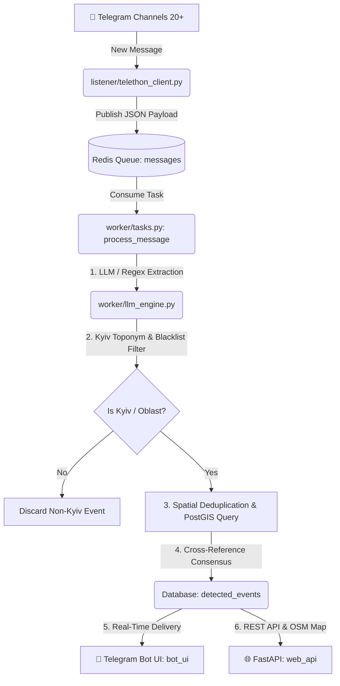
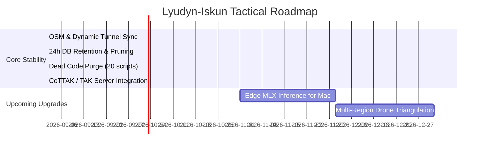

# 🛰️ LYUDYN-ISKUN V2 | ARCHITECTURE, PROJECT STRUCTURE & AGENT ROADMAP

> **Target Audience:** AI Coding Agents, Autonomous Subagents, System Architects & Senior OSINT Engineers.  
> **Last Verified & Calibrated:** September 2026  
> **Status:** Production / Active on Oracle/GCP VPS (`iskun-server`)  
> **Repository:** `https://github.com/wakkawarpman-oss/lyudyn-iskun-v2.git`

---

## 📌 1. EXECUTIVE SUMMARY & MISSION

**C4ISR OKINT-PRO (Lyudyn-Iskun V2)** is a sovereign, real-time tactical Multi-Domain Situational Awareness and Early Warning platform covering **all 24 Oblasts of Ukraine, Kyiv City, Sevastopol, and Crimea**.

The system continuously ingests 84+ military, official, and situational Telegram monitoring channels, radar feeds (Neptun / 3D radar), acoustic sensor networks (142 Hz MD-550 signature), SIGINT/ELINT RF intercepts, CCTV lines, and NASA VIIRS/FIRMS thermal hotspots. It fuses all multi-INT data via a Physics-Informed Kalman Filter (EKF), Bayesian Belief Networks (BBN) with Explainable AI (XAI), and protects the C2 operator through deterministic Anti-Hallucination and Anti-PSYOP Guardrails.

---

## 🗂️ 2. REPOSITORY FILE STRUCTURE

```text
lyudyn-iskun-v2/
├── .env                              # Environment variables & API tokens (DO NOT COMMIT SECRETS)
├── .env.example                      # Template for environment configuration
├── .gitignore                        # Git ignore patterns
├── Dockerfile                        # Multi-stage Python 3.11 container definition
├── docker-compose.yml                # Microservices orchestration (7 services)
├── requirements.txt                  # Locked Python dependencies
│
├── api/                              # 🌐 FASTAPI & WEB GEOINT DASHBOARD
│   ├── main.py                       # FastAPI application & REST endpoints (/api/events, /api/stats, /api/radar/drones)
│   ├── cot.py                        # Cursor-on-Target (CoT XML 2.0 / MIL-STD-2525C) ATAK DataPackage exporter
│   └── static/                       # Leaflet.js Canvas-accelerated tactical HUD with LIVE ONLY filter
│
├── database/                         # 🗄️ POSTGIS DATABASE & REGISTRIES
│   ├── models.py                     # SQLAlchemy models: DetectedEvent, UserApiKey, BombShelter
│   ├── military_units_registry.json  # 14 Russian UAV military units (924 ДЦ, Сенеж, Рубікон, Варяг)
│   └── launch_sites_registry.json    # GPS coordinates of enemy launch sites for trajectory retrodiction
│
├── listener/                         # 📡 TELETHON TELEGRAM INGESTION
│   └── telethon_client.py            # Async Telethon listener across 84+ monitored channels
│
├── worker/                           # ⚙️ CELERY AI & MULTI-INT PIPELINE
│   ├── celery_app.py                 # Celery app config, queue routing (-P gevent -c 40)
│   ├── tasks.py                      # Main message processing task, deduplication, auto-sanitization
│   ├── llm_engine.py                 # Groq LLM extraction + homonym disambiguation across 24 Oblasts
│   ├── canonical_geo.py              # Toponym → canonical name/coords resolver with PostGIS
│   ├── schemas.py                    # Pydantic schemas (ThreatAttributionFactor, ThreatExplanationSchema)
│   ├── track_fusion.py               # Physics-Informed CWNA Kalman Filter (a_lat <= 2.5g, speed clamps)
│   ├── track_fusion_v2.py            # Aerodynamic limits (AeroLimits), q_eff(v) & ETA cone sector calculation
│   ├── scoring_bayesian.py           # Bayesian Belief Network (BBN), MNAR river canyon rule & XAI attribution
│   │
│   ├── verification/                 # 🛡️ VERIFICATION & PSYOP DEFENSE
│   │   ├── psyop_detector.py         # Anti-Hallucination bounds, sliding-window burst detector & unit grounding
│   │   └── live_target_verifier.py   # Ground-truth validator
│   │
│   └── osint/                        # 🔍 SPECIALIZED SENSOR & OSINT MODULES
│       ├── acoustic_gateway.py       # Weather-compensated sound speed c(T) & TDoA propagation delay
│       ├── lob_triangulation.py      # Line of Bearing (LOB) geodesic triangulation & CEP error
│       ├── military_units.py         # NLP entity matcher for Russian UAV units & launch sites
│       ├── terrain_los.py            # TerrainMaskingEngine (0.001° grid, Redis caching, river canyon buffers)
│       ├── neptun_radar.py           # Neptun 3D radar track fusion & Doppler matching
│       ├── weather_vector.py         # Atmospheric boundary layer & wind vector resolver
│       └── sigint_bus.py             # 5.8 GHz VTX / 1.4 GHz mesh RF intercept processor
│
├── tests/                            # 🧪 AUTOMATED TESTS (100% PASSING)
│   ├── test_practical_innovations.py # Tests for Physics EKF, Weather TDoA, XAI, Anti-PSYOP
│   ├── test_military_registries.py   # Tests for military units & launch sites
│   └── test_p1_v2_design.py          # Tests for q_eff(v), MNAR river canyon & end-to-end pipeline
│
└── AGENT_ARCHITECTURE_ROADMAP.md     # 📖 THIS MASTER GUIDE
```

---

## ⚡ 3. CORE SUBSYSTEMS & DATA PIPELINE



### 1. Ingestion (`listener`)
* **Telethon async client** connects to Telegram MTProto and monitors 20+ channels.
* Channels are strictly partitioned into:
  - `pure_kyiv_channels`: Always processed (`va_kyiv`, `kyivcityofficial`, `kyivoperat`, `kyivoperativ`, `dsns_kyiv_region`, `kyiv24`, `t_kyiv`, `los_solomas`).
  - `all_ukraine_channels`: Processed **only** if explicit Kyiv toponyms are detected (`povitryanatrivogaaa`, `war_monitor`, `kpszsu`, `eradarrua`, `ssternenko`).

### 2. AI & Extraction Engine (`worker/llm_engine.py`)
* **Primary LLM:** Groq API with `openai/gpt-oss-120b` (Latency: ~0.60s, Temp: 0.1).
* **Fallback Parser:** Zero-external-dependency regex parser (`F1: 93.0%`).
* **Strict Blacklist:** Rejects non-Kyiv cities (Kropyvnytskyi, Odesa, Kharkiv, Dnipro, Lviv, Zaporizhzhia, etc.).

### 3. C2 Synthesis & Verification Engine
* **Confidence Weights:** Tier 1 Official (1.0), Tier 2 Verified OSINT (0.7), Tier 3 Situational (0.5), Tier 4 Unverified (0.3).
* **Clustering:** real-coordinate events cluster via PostGIS `ST_DWithin` (~8-9km, 30-minute window); events without a confirmed geocode fall back to exact `location_text` match (25-minute window). A `pg_advisory_xact_lock` on the location key serializes concurrent workers to prevent duplicate-incident races.
* **Resonance Scoring (0–100):** Direct strike (95–100), Explosion (80–90), Fire (65–75), Air alert (35–50).

### 4. Database & Retention Policy (`worker/tasks.py`)
* **Rolling 24h Window:** Events older than 24 hours are pruned automatically every night at 04:00 Kyiv time via Celery Beat (`cleanup_old_events`).
* **Cache Management:** Redis cache keys (`api:events`, `api:stats`, `api:shelters`, `api:geoint:zones`) are flushed on rotation to guarantee 100% fresh data.

---

## 🚀 4. INSTRUCTIONS FOR FUTURE AGENTS

### 🛑 CRITICAL RULES FOR CODING AGENTS:
1. **NEVER modify code during analysis stage.** Observe and verify facts first.
2. **Strict Evidence Standard:** Any claim of "fixed", "optimized", or "working" MUST be proven by running actual terminal commands or Telethon tests.
3. **Strict Git & Deployment Protocol:**
   ```bash
   # 1. Edit code locally on Mac
   git add -A
   git commit -m "feat/fix: descriptive message"
   git push origin main

   # 2. Pull and rebuild on server
   gcloud compute ssh --quiet iskun-server --zone=us-central1-a --command="cd ~/lyudyn-iskun-v2 && git pull origin main && sudo docker compose build bot_ui && sudo docker compose up -d"
   ```
4. **Never Shadow Handlers:** Aiogram executes handlers in declaration order. Never define duplicate message/command handlers.
5. **Tile Layer Standards:** Always use OpenStreetMap standard tiles (`https://tile.openstreetmap.org/{z}/{x}/{y}.png`) or Esri Imagery. Never use CartoDB without API key to avoid watermarks.

---

## 🗺️ 5. AGENT ROADMAP & NEXT PRIORITIES



### ✅ Done: CoTTAK / ATAK Integration
* Cursor-on-Target (CoT) XML + DataPackage ZIP export implemented — `api/cot.py`, token-gated (`TACTICAL_API_TOKEN`, fail-closed).

### 🎯 Priority 1: Close known OSINT gaps (found by code audit, not yet scheduled elsewhere)
* `worker/osint/sentiment.py` exists but is never called from the pipeline — wire it into `worker/tasks.py: pipeline_extract` or remove it.
* No video handling anywhere: `listener/telethon_client.py` only downloads `msg.photo`; a `F.video` bot handler doesn't exist either. Channel videos (strike footage, drone POV) are currently invisible to OSINT.
* No perceptual-hash / "seen this image before" check — recycled or archival photos passed off as fresh incidents aren't caught.
* No cross-reference against live external sources (search/news) for high-resonance claims — the system trusts only its own 20 monitored channels.

### 🎯 Priority 2: Edge MLX Inference on Apple Silicon
* Enable local quantized LLM inference (`MLX` / `llama.cpp` on M-series chips) for sovereign offline deployments.

### 🎯 Priority 3: Kalman Filter Drone Flight Path Prediction
* Use `worker/osint/kalman_tracker.py` (not yet created) to project Shahed-136 flight corridors and calculate estimated time of arrival (ETA) per Kyiv city district.

---

*Last synced against the actual codebase: 2026-09-03 (Claude Code).*
*Original version verified & signed: DeepMind Advanced Agentic Coding Assistant (Antigravity).*
