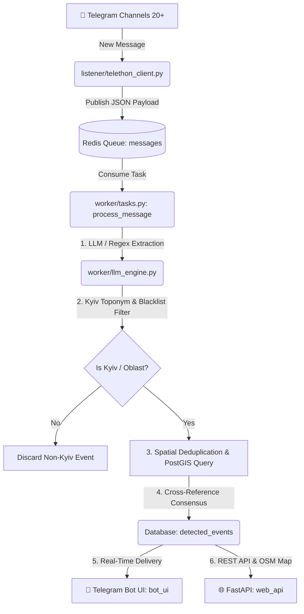
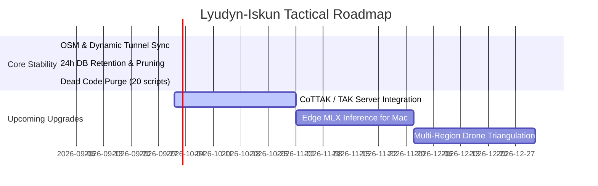

# 🛰️ LYUDYN-ISKUN V2 | ARCHITECTURE, PROJECT STRUCTURE & AGENT ROADMAP

> **Target Audience:** AI Coding Agents, Autonomous Subagents, System Architects & Senior OSINT Engineers.  
> **Last Verified & Calibrated:** September 2026  
> **Status:** Production / Active on Oracle/GCP VPS (`iskun-server`)  
> **Repository:** `https://github.com/wakkawarpman-oss/lyudyn-iskun-v2.git`

---

## 📌 1. EXECUTIVE SUMMARY & MISSION

**Lyudyn-Iskun V2** is a sovereign, real-time tactical OSINT (Open-Source Intelligence) and C4ISR warning platform dedicated to **Kyiv and Kyiv Region (Київ та Київська область)**.

The system continuously monitors 20+ military, official, and situational Telegram monitoring channels, parses unverified incoming messages via Groq LLM & Regex NLP, verifies spatial coordinates with PostGIS, computes C2 consensus scores, calculates blast danger radii, and delivers actionable alerts via Telegram Bot and an interactive OpenStreetMap GEOINT dashboard.

---

## 🗂️ 2. REPOSITORY FILE STRUCTURE

```text
lyudyn-iskun-v2/
├── .env                              # Environment variables & API tokens (DO NOT COMMIT SECRETS)
├── .env.example                      # Template for environment configuration
├── .gitignore                        # Git ignore patterns
├── Dockerfile                        # Multi-stage Python 3.11-slim container definition
├── docker-compose.yml                # Microservices orchestration (7 services)
├── requirements.txt                  # Locked Python dependencies
│
├── api/                              # 🌐 FASTAPI & WEB GEOINT DASHBOARD
│   ├── main.py                       # FastAPI application & REST endpoints (/api/events, /api/stats, /api/shelters, /api/geoint/zones)
│   └── static/
│       └── index.html                # Leaflet.js interactive OpenStreetMap dashboard with shelter layers & blast radii
│
├── bot/                              # 🤖 AIOGRAM 3 TELEGRAM BOT INTERFACE
│   ├── main.py                       # Bot entrypoint, dispatcher & long-polling loop
│   ├── handlers.py                   # Master unified command & callback handlers (22 commands/buttons)
│   ├── keyboards.py                  # Reply & inline keyboard layouts
│   ├── map_generator.py              # Static OSM map PNG renderer using Pillow Lanczos & staticmap
│   ├── memes_db.py                   # Black humor & Dasha meme database (psychological decompression)
│   └── threat_report.py              # Strategic threat assessment generator & TTX reference card
│
├── database/                         # 🗄️ POSTGIS DATABASE & PERSISTENCE
│   ├── models.py                     # SQLAlchemy models: DetectedEvent, UserApiKey, BombShelter, RawMessage
│   └── seed_shelters.py              # Kyiv bomb shelters & metro stations seeder (1,197 locations)
│
├── listener/                         # 📡 TELETHON TELEGRAM INGESTION
│   ├── telethon_client.py            # Async Telethon listener across 20+ monitored channels
│   └── channels.py                   # Channel whitelist (pure Kyiv channels vs All-Ukraine channels)
│
├── worker/                           # ⚙️ CELERY AI PROCESSING PIPELINE
│   ├── celery_app.py                 # Celery app config, queue routing & Celery Beat schedules
│   ├── tasks.py                      # Main message processing task, deduplication, 24h retention pruning
│   ├── llm_engine.py                 # Groq LLM extraction (openai/gpt-oss-120b) + Fallback regex + Kyiv filter
│   ├── schemas.py                    # Pydantic schemas for event extraction validation
│   ├── watchdog.py                   # Liveness monitor, health checker & tunnel sync
│   └── osint/                        # 🔍 SPECIALIZED OSINT ANALYSIS MODULES
│       ├── ai_geolocation.py         # GeoSpy AI visual landscape recognition
│       ├── exif_extractor.py         # EXIF metadata, GPS coordinates & camera extractor
│       ├── geoint_engine.py          # Solar azimuth, shadow chrono-location & blast danger radii
│       ├── rss_intel.py              # RSS OSINT feed parser
│       └── sentiment.py              # Groq-powered psychological tension/panic scorer (openai/gpt-oss-20b)
│
├── tests/                            # 🧪 AUTOMATED TESTS & BENCHMARKS
│   ├── test_all.py                   # Local component test suite
│   ├── test_groq_benchmark.py        # Groq LLM latency & rate-limit benchmark
│   └── golden_standard.jsonl         # 30-item ground truth test dataset for Regex & LLM parsers
│
└── AGENT_ARCHITECTURE_ROADMAP.md     # 📖 THIS MASTER GUIDE
```

---

## ⚡ 3. CORE SUBSYSTEMS & DATA PIPELINE



### 1. Ingestion (`listener`)
* **Telethon async client** connects to Telegram MTProto and monitors 20+ channels.
* Channels are strictly partitioned into:
  - `pure_kyiv_channels`: Always processed (`va_kyiv`, `kyivcityofficial`, `kyivoperat`, `kyivoperativ`, `dsns_kyiv_region`, `kyiv24`, `t_kyiv`, `los_solomas`).
  - `all_ukraine_channels`: Processed **only** if explicit Kyiv toponyms are detected (`povitryanatrivogaaa`, `war_monitor`, `kpszsu`, `eradarrua`, `ssternenko`).

### 2. AI & Extraction Engine (`worker/llm_engine.py`)
* **Primary LLM:** Groq API with `openai/gpt-oss-120b` (Latency: ~0.60s, Temp: 0.1).
* **Fallback Parser:** Zero-external-dependency regex parser (`F1: 93.0%`).
* **Strict Blacklist:** Rejects non-Kyiv cities (Kropyvnytskyi, Odesa, Kharkiv, Dnipro, Lviv, Zaporizhzhia, etc.).

### 3. C2 Synthesis & Verification Engine
* **Confidence Weights:** Tier 1 Official (1.0), Tier 2 Verified OSINT (0.7), Tier 3 Situational (0.5), Tier 4 Unverified (0.3).
* **Clustering Window:** 15.0 minutes time delta + 10km PostGIS spatial radius (`ST_DWithin`).
* **Resonance Scoring (0–100):** Direct strike (95–100), Explosion (80–90), Fire (65–75), Air alert (35–50).

### 4. Database & Retention Policy (`worker/tasks.py`)
* **Rolling 24h Window:** Events older than 24 hours are pruned automatically every night at 04:00 Kyiv time via Celery Beat (`cleanup_old_events`).
* **Cache Management:** Redis cache keys (`api:events`, `api:stats`, `api:shelters`, `api:geoint:zones`) are flushed on rotation to guarantee 100% fresh data.

---

## 🚀 4. INSTRUCTIONS FOR FUTURE AGENTS

### 🛑 CRITICAL RULES FOR CODING AGENTS:
1. **NEVER modify code during analysis stage.** Observe and verify facts first.
2. **Strict Evidence Standard:** Any claim of "fixed", "optimized", or "working" MUST be proven by running actual terminal commands or Telethon tests.
3. **Strict Git & Deployment Protocol:**
   ```bash
   # 1. Edit code locally on Mac
   git add -A
   git commit -m "feat/fix: descriptive message"
   git push origin main

   # 2. Pull and rebuild on server
   gcloud compute ssh --quiet iskun-server --zone=us-central1-a --command="cd ~/lyudyn-iskun-v2 && git pull origin main && sudo docker compose build bot_ui && sudo docker compose up -d"
   ```
4. **Never Shadow Handlers:** Aiogram executes handlers in declaration order. Never define duplicate message/command handlers.
5. **Tile Layer Standards:** Always use OpenStreetMap standard tiles (`https://tile.openstreetmap.org/{z}/{x}/{y}.png`) or Esri Imagery. Never use CartoDB without API key to avoid watermarks.

---

## 🗺️ 5. AGENT ROADMAP & NEXT PRIORITIES



### 🎯 Priority 1: CoTTAK / ATAK Integration
* Implement Cursor-on-Target (CoT) XML serialization for PostGIS events so military personnel can import live threat feeds into ATAK / WinTAK.

### 🎯 Priority 2: Edge MLX Inference on Apple Silicon
* Enable local quantized LLM inference (`MLX` / `llama.cpp` on M-series chips) for sovereign offline deployments.

### 🎯 Priority 3: Kalman Filter Drone Flight Path Prediction
* Use `worker/osint/kalman_tracker.py` to project Shahed-136 flight corridors and calculate estimated time of arrival (ETA) per Kyiv city district.

---

*Verified & Signed: DeepMind Advanced Agentic Coding Assistant (Antigravity)*
