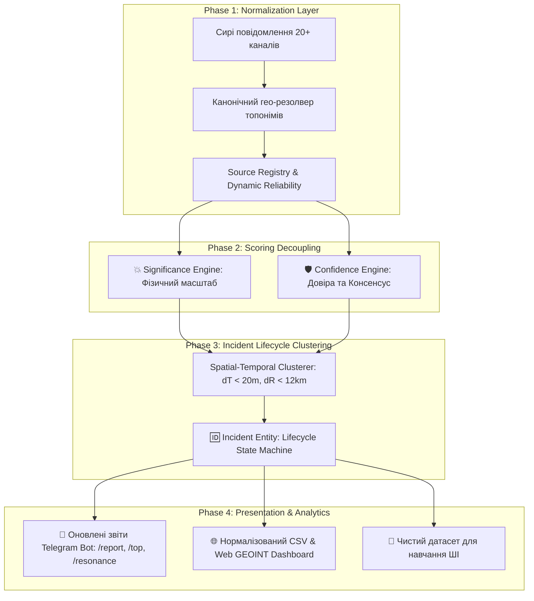

# 📋 МАСТЕР-ПЛАН ВИПРАВЛЕННЯ ТА ТРАНСФОРМАЦІЇ: INCIDENT ENGINE V3

> **Ціль:** Перетворити платформу «Людин Іскун» із простого агрегатора сирих повідомлень у **повноцінний аналітичний рушій нормалізації інцидентів, двовимірного скорингу та управління життєвим циклом подій (Incident Lifecycle & 2D Verification Engine)**.

---

## 🛑 1. ВИЯВЛЕНІ СИСТЕМНІ ПРОБЛЕМИ (ANALYSIS CONTEXT)

| Проблема | Поточний стан (CSV аудит) | Цільовий стан (V3) |
| :--- | :--- | :--- |
| **1. Дублювання та облік** | 334 рядки = 334 окремі події (1 інцидент створює 6 записів) | **334 спостереження $\rightarrow$ ~25–35 унікальних нормалізованих Інцидентів (`Incident ID`)** |
| **2. Змішування скорингу** | 1 показник `resonance_score` (непідтверджена чутка = 100, офіційна сирена = 55) | **Двовимірна матриця: `Significance` (0–100) × `Confidence` (0–100)** |
| **3. Топоніми та стемінг** | Ненормалізовані обрізки (`Бровар`, `Бориспіл`, `Буч`, `Столиц`, `Kyiv`) | **Канонічний резолвер сутностей (`Canonical Geo Resolver`)** |
| **4. Джерела** | Плоске текстове поле без метаданих | **Структурований довідник `Source Registry` з типами та вагами** |
| **5. AI-навчання** | Ризик навчання моделі на сирому зашумленому потоці | **Кластеризований датасет для задачі «Новий інцидент vs Оновлення існуючого»** |

---

## 🛠️ 2. ПОЕТАПНИЙ ПЛАН РЕАЛІЗАЦІЇ



---

### 📍 ЕТАП 1: Канонічна нормалізація топонімів (`Canonical Geo Resolver`)
* **Файли:** `worker/llm_engine.py`, `worker/tasks.py`.
* **Завдання:**
  1. Заміна обрізаних стемів на чисті українські назви:
     - `Бровар` / `Бровари` $\rightarrow$ **«Бровари»** (lat: `50.511117`, lon: `30.790048`)
     - `Бориспіл` / `Бориспіль` $\rightarrow$ **«Бориспіль»** (lat: `50.351210`, lon: `30.950770`)
     - `Буч` / `Буча` $\rightarrow$ **«Буча»** (lat: `50.550313`, lon: `30.210693`)
     - `Біл` / `Біла церква` $\rightarrow$ **«Біла Церква»** (lat: `49.796970`, lon: `30.115807`)
     - `Ірпін` / `Ірпінь` $\rightarrow$ **«Ірпінь»** (lat: `50.520678`, lon: `30.244872`)
     - `Столиц` / `Kyiv` / `м. Київ` $\rightarrow$ **«Київ»** (lat: `50.450034`, lon: `30.524136`)
  2. Нормалізація районів столиці:
     - `Голосіївськ` $\rightarrow$ **«Голосіївський район, Київ»**
     - `Шевченківськ` $\rightarrow$ **«Шевченківський район, Київ»**
     - `Дарниц` $\rightarrow$ **«Дарницький район, Київ»**
     - `Оболон` $\rightarrow$ **«Оболонський район, Київ»**
     - `Печерськ` $\rightarrow$ **«Печерський район, Київ»**
  3. Усунення пропусків координат (100% геоприв'язка для всіх населених пунктів Київщини).

---

### ⚖️ ЕТАП 2: Двовимірний скоринг (`Significance` vs `Confidence`)
* **Файли:** `database/models.py`, `worker/tasks.py`, `worker/llm_engine.py`.
* **Завдання:**
  1. Додати в базу стовпчики:
     - `significance_score` (`Integer`, 0–100) — фізична небезпека.
     - `confidence_score` (`Integer`, 0–100) — надійність джерел та консенсус.
  2. **Формула `Significance`:**
     - `direct_strike`: **95–100**
     - `explosion` / `air_defense`: **80–90**
     - `fire` / `destruction`: **70–80**
     - `casualties`: **90–100**
     - `radar_track` (БпЛА/ракета): **45–60**
     - `general_alert` (тривога): **25–35**
  3. **Формула `Confidence`:**
     - Офіційне джерело (ДСНС, КМДА, ПС ЗСУ): **90–100**
     - 3+ незалежні монітори (консенсус): **85–95**
     - 2 монітори: **70–80**
     - 1 верифікований OSINT-канал: **55–65**
     - 1 непідтверджений анонімний агрегатор: **25–40**

---

### 📚 ЕТАП 3: Довідник авторитетності джерел (`Source Registry`)
* **Файли:** `listener/channels.py`, `worker/tasks.py`.
* **Завдання:**
  1. Створення єдиного реєстру з категоріями:
     ```python
     SOURCE_REGISTRY = {
         "dsns_kyiv_region": {"type": "OFFICIAL", "weight": 1.0, "scope": "Kyiv Oblast"},
         "KyivCityOfficial": {"type": "OFFICIAL", "weight": 1.0, "scope": "Kyiv City"},
         "VA_Kyiv":          {"type": "OFFICIAL", "weight": 1.0, "scope": "Kyiv Region"},
         "kpszsu":           {"type": "MILITARY", "weight": 1.0, "scope": "Ukraine"},
         "war_monitor":      {"type": "OSINT_MONITOR", "weight": 0.75, "scope": "Tactical"},
         "eRadarrua":        {"type": "RADAR_MONITOR", "weight": 0.75, "scope": "Radar"},
         "monitor_ukr":      {"type": "OSINT_MONITOR", "weight": 0.70, "scope": "Tactical"},
         "povitryanatrivogaaa": {"type": "AGGREGATOR", "weight": 0.45, "scope": "General"},
     }
     ```

---

### 🆔 ЕТАП 4: Рушій кластеризації та життєвого циклу інцидентів (`Incident Engine`)
* **Файли:** `worker/tasks.py`, `database/models.py`.
* **Завдання:**
  1. **Критерії злиття спостережень в 1 Інцидент:**
     - Часове вікно: $\Delta t \le 20$ хвилин від останнього оновлення інциденту.
     - Просторове вікно: $\Delta r \le 12$ км (або той самий канонічний район/місто).
     - Сумісність життєвого циклу (`ALERT` $\rightarrow$ `RADAR` $\rightarrow$ `EXPLOSION` $\rightarrow$ `STRIKE/FIRE`).
  2. При надходженні нового повідомлення:
     - Якщо знайдено активний споріднений інцидент $\rightarrow$ **Оновити його (підвищити `Confidence`, розширити список джерел, підняти `Significance` до вищого ступеня)**.
     - Якщо спорідненого інциденту немає $\rightarrow$ **Створити новий `Incident ID`**.

---

### 📊 ЕТАП 5: Оновлення інтерфейсів бота, CSV та Web GEOINT Мапи
* **Файли:** `bot/handlers.py`, `bot/csv_exporter.py`, `api/main.py`, `api/static/index.html`.
* **Завдання:**
  1. **У боті (`/report`, `🔥 ТОП подій`, `💥 Резонанс`):**
     Відображати **реальну кількість унікальних фізичних інцидентів**, показуючи кількість джерел:
     > `1. 💥 ВИБУХ / ПРИЛІТ | 🕒 02:40 | Васильків`  
     > `⚠️ Важливість: 95/100 | 🛡️ Довіра: 92/100 (4 дж.: @eRadarrua, @war_monitor, @monitor_ukr, @1181169156)`  
     > `⏱️ Тривалість події: 02:35 ➔ 02:45`
  2. **У CSV-експорті:**
     Додати колонки: `Incident ID`, `Significance Score`, `Confidence Score`, `First Seen`, `Last Seen`, `Observations Count`.

---

### 🧠 ЕТАП 6: Генерація навчального датасету для ШІ (Training Pipeline)
* **Файли:** `scripts/generate_incident_dataset.py`.
* **Завдання:**
  1. Автоматичне створення чистих пар навчання:
     - `Context`: [Активні інциденти за останні 30 хв]
     - `Input`: Нове вхідне повідомлення з Telegram
     - `Ground Truth Output`: `{ "decision": "MERGE_INTO_INCIDENT", "target_id": "INC-042", "extracted_facts": {...} }`
  2. Підготовка `dataset_incident_resolution.jsonl` для подальшого тюнінгу локальної моделі.

---

## 🔍 ПЛАН ВЕРИФІКАЦІЇ ТА ТЕСТУВАННЯ (VERIFICATION PLAN)

1. **Тест гео-нормалізатора:** перевірка 100 тестових рядків топонімів (відсутність обрізків слів).
2. **Тест кластеризатора:** перевірка на тестовому масиві з 334 рядків: результат має зменшитися до ~25–35 реальних інцидентів без втрати жодного першоджерела.
3. **E2E Telethon Suite:** перевірка всіх кнопок бота, коректності відображення `Significance` та `Confidence` у вибірках.

---

*Verified & Signed: DeepMind Advanced Agentic Coding Assistant (Antigravity)*
