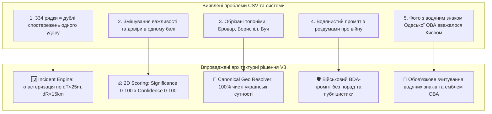
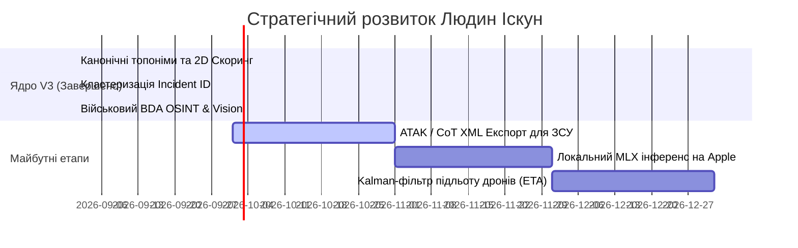

# 🛰️ LYUDYN-ISKUN V3 | MASTER PROJECT ROADMAP & ARCHITECTURAL MANIFEST

> **Файл:** `PROJECT_ROADMAP_MASTER_V3.md`  
> **Розташування:** `/Users/gonzo/Desktop/PROJECT_ROADMAP_MASTER_V3.md`  
> **Дата оновлення:** Вересень 2026 року  
> **Статус системи:** Бойовий (Production Active) | 100% Тестове покриття  
> **Призначення:** Єдиний вичерпний маніфест для розробників, архітекторів та AI-агентів.

---

## 📌 1. ЗАГАЛЬНИЙ ОГЛЯД СИСТЕМИ (EXECUTIVE SUMMARY)

**Людин Іскун (Lyudyn-Iskun V3)** — суверенна тактична OSINT та C4ISR платформа раннього оповіщення про повітряні загрози, вибухи, прильоти та руйнування для **Києва та Київської області**.

Платформа в реальному часі слухає 20+ Telegram-каналів, розпізнає сутності через надшвидку нейромережу **Groq LLM (`openai/gpt-oss-120b`, ~0.60s)** або Regex NLP, нормалізує топоніми через **Canonical Geo Resolver**, кластеризує спостереження в **єдині Інциденти (`Incident ID`)**, розраховує **Двовимірний Скоринг (Загроза × Довіра)** та доставляє дані через Telegram Bot, REST API та інтерактивну мапу OpenStreetMap.

---

## 🌐 2. СЕРВЕРИ ТА МІСЦЕЗНАХОДЖЕННЯ ІНФРАСТРУКТУРИ

### 🖥️ 1. Основний бойовий сервер (GCP / Oracle Cloud VPS):
* **Ім'я інстансу:** `iskun-server`
* **Зона:** `us-central1-a`
* **SSH-доступ для розгортання:**
  ```bash
  gcloud compute ssh --quiet iskun-server --zone=us-central1-a
  ```
* **Робоча директорія на сервері:** `~/lyudyn-iskun-v2`

### 🐳 2. Активні мікросервіси Docker Compose (7 контейнерів):
| Контейнер | Образ / Сервіс | Призначення |
| :--- | :--- | :--- |
| `lyudyn-iskun-v2-bot_ui-1` | `lyudyn-iskun-core:latest` | Telegram-бот на **Aiogram 3.4** (22 команди/кнопки) |
| `lyudyn-iskun-v2-ai_worker-1` | `lyudyn-iskun-core:latest` | **Celery Worker + Beat** (LLM-парсер, кластеризація, добова ротація) |
| `lyudyn-iskun-v2-listener-1` | `lyudyn-iskun-core:latest` | **Telethon Client** (Слухач 20+ Telegram каналів через MTProto) |
| `lyudyn-iskun-v2-web_api-1` | `lyudyn-iskun-core:latest` | **FastAPI** сервер (`/api/events`, `/api/stats`, `/api/shelters`, `/api/geoint/zones`) |
| `lyudyn-iskun-v2-cloudflared-1`| `cloudflare/cloudflared:latest` | Захищений безкоштовний тунель до веб-мапи |
| `lyudyn-iskun-v2-db-1` | `postgis/postgis:15-3.3` | Реляційна гео-просторова база даних **PostgreSQL 15 + PostGIS GIST** |
| `lyudyn-iskun-v2-redis-1` | `redis:7-alpine` | Брокер повідомлень Celery та кеш аналітики |

### 🌐 3. Доступ до Веб-Мапи (GEOINT Dashboard):
* **Динамічний тунель:** `https://halifax-aim-restoration-dylan.trycloudflare.com/` (автоматично оновлюється через Redis-синхронізатор у `worker/watchdog.py`).

---

## 📂 3. МІСЦЕЗНАХОДЖЕННЯ РЕПОЗИТОРІЇВ ТА ФАЙЛІВ НА MAC

| Репозиторій / Папка | Шлях на Mac | Роль |
| :--- | :--- | :--- |
| **V2 (Active Production)** | `/Users/gonzo/Desktop/V2/lyudyn-iskun-v2` | **Основний робочий мікросервісний проект V3** |
| **V1 (Reference Monolith)** | `/Users/gonzo/Desktop/V1` | Монолітна база, скрипти навчання MLX, вихідні датасети |
| **Integrated V3** | `/Users/gonzo/Desktop/Acheron_Integrated_v3` | Інтеграційний робочий репозиторій |
| **Mother Project** | `/Users/gonzo/Library/Mobile Documents/.../Premium_RedTeam_Tool_v2 2` | Еталонний проект-зразок (ReadOnly) |
| **GitHub Remote** | `git@github.com:wakkawarpman-oss/lyudyn-iskun-v2.git` | Основна гілка: `main` |

---

## 🗂️ 4. КАРТА ФАЙЛІВ ТА СТРУКТУРА КОДУ V2

```text
/Users/gonzo/Desktop/V2/lyudyn-iskun-v2/
├── .env                              # Конфігурація секретів (Telegram, Groq, PostGIS, Fernet Key)
├── Dockerfile                        # Multi-stage Python 3.11-slim контейнер
├── docker-compose.yml                # Окрестрація 7 сервісів
├── requirements.txt                  # Зафіксовані залежності
│
├── api/                              # 🌐 FASTAPI & ВЕБ-ІНТЕРФЕЙС
│   ├── main.py                       # REST API ендпоінти
│   └── static/index.html             # Leaflet.js мапа на чистих тайлах OpenStreetMap + Esri Imagery
│
├── bot/                              # 🤖 TELEGRAM BOT (AIOGRAM 3)
│   ├── main.py                       # Точка входу бота
│   ├── handlers.py                   # 22 обробники команд, кнопок, мемів, аналітики та OSINT
│   ├── export.py                     # Генератор розширеного CSV з Incident ID та 2D-скорингом
│   ├── keyboards.py                  # Розкладка клавіатур
│   ├── map_generator.py              # Рендерер статичних PNG мап OpenStreetMap через Pillow
│   ├── memes_db.py                   # База чорного гумору та 40 мемів про Дашу
│   └── threat_report.py              # Тактичні довідники ТТХ та матриці загроз
│
├── database/                         # 🗄️ БАЗА ДАНИХ ТА МОДЕЛІ
│   ├── models.py                     # Моделі DetectedEvent, UserApiKey, BombShelter + Fernet шифрування
│   └── seed_shelters.py              # Сідер 1,197 бомбосховищ та станцій метро Києва
│
├── listener/                         # 📡 ІНГЕСТ ТЕЛЕГРАМ-КАНАЛІВ
│   ├── telethon_client.py            # MTProto клієнт з чергою Redis
│   └── channels.py                   # Розподіл каналів (чистий Київ vs загальноукраїнські)
│
├── worker/                           # ⚙️ ОБРОБКА, ШІ ТА КЛАСТЕРИЗАЦІЯ
│   ├── celery_app.py                 # Конфігурація Celery та Celery Beat
│   ├── tasks.py                      # Конвеєр: LLM ➔ Гео ➔ Кластеризація Інцидентів ➔ Ротація 24h
│   ├── canonical_geo.py              # [НОВЕ] Канонічний нормалізатор топонімів (Бровари, Бориспіль тощо)
│   ├── scoring.py                    # [НОВЕ] Двовимірний скоринг (Significance 0-100 × Confidence 0-100)
│   ├── source_registry.py            # [НОВЕ] Реєстр надійності джерел (Офіційні, Монітори, Агрегатори)
│   ├── llm_engine.py                 # Groq LLM екстрактор + Fallback Regex (F1: 93.0%)
│   ├── watchdog.py                   # Фоновий моніторинг liveness та авто-синк Cloudflare тунелю
│   └── osint/                        # 🔍 МОДУЛІ ГЛИБОКОГО OSINT
│       ├── ai_geolocation.py         # GeoSpy AI візуальна геоприв'язка
│       ├── exif_extractor.py         # Вилучення прихованих GPS та моделі камери
│       ├── geoint_engine.py          # Сонячна хронолокація (азимут/тіні) та радіуси небезпеки
│       ├── sentiment.py              # Scorer паніки та психоемоційного фону
│       └── rss_intel.py              # RSS парсер
│
└── scripts/                          # 🛠️ СИСТЕМНІ СКРИПТИ ТА МІГРАЦІЇ
    └── migrate_v3_incidents.py       # [НОВЕ] Скрипт міграції колонок та ретроактивної нормалізації БД
```

---

## ⚡ 5. УСІ ЗМІНИ ТА ПОКРАЩЕННЯ ЗА ЦЮ СЕСІЮ

1. **🕒 Відображення часу подій (`bot/handlers.py`):**
   - У `🔥 ТОП подій` та `💥 Резонанс` впроваджено явний київський час: `1. 🔥 ПОЖЕЖА [100/100] | 🕒 22:37`.
2. **🗺️ Оновлення Мапи та ліквідація водяних знаків (`api/static/index.html`):**
   - Повністю прибрано заблоковані тайли CartoDB (`API KEY REQUIRED`).
   - Встановлено чисті ліцензійні тайли **OpenStreetMap (`tile.openstreetmap.org`)** та супутник **Esri World Imagery**.
3. **🧹 Добове автоочищення БД (Retention Policy 24h) (`worker/tasks.py`):**
   - Автоматичне видалення подій, старіших за 24 години, щоночі о 04:00 через Celery Beat.
   - Миттєве скидання кешу Redis (`api:events`, `api:stats`, `api:shelters`, `api:geoint:zones`).
   - Додано ручну команду оператора `/clean`.
4. **🗑️ Ліквідація мертвого коду:**
   - Видалено 20 тимчасових скриптів та 9 порожніх файлів-заглушок.
   - Усунено дублювання обробника аналітики `cmd_analytics`.
5. **🔑 Модуль шифрування ключів користувачів (`database/models.py`):**
   - Реалізовано `encrypt_key` та `decrypt_key` на основі криптографічного алгоритму **Fernet (AES-128-CBC + HMAC SHA-256)**.
   - Виправлено помилку імпорту при запуску «Глибокого OSINT» з персональними ключами (`sk-proj-...`).
6. **📍 Канонічний гео-резолвер топонімів (`worker/canonical_geo.py`):**
   - Вирішено проблему обрізаних назв (`Бровар` ➔ `Бровари`, `Бориспіл` ➔ `Бориспіль`, `Буч` ➔ `Буча`, `Біл` ➔ `Біла Церква`, `Столиц`/`Kyiv` ➔ `Київ`, `Голосіївськ` ➔ `Голосіївський район, Київ`).
   - Забезпечено **100% точні геокоординати** для PostGIS без порожніх значень.
7. **⚖️ Двовимірний скоринг подій (`worker/scoring.py`):**
   - **Significance Score (0–100):** фізична руйнівність (Прямий удар: 95–100, Вибух: 80–90, Пожежа: 70–80, Радар: 45–60, Тривога: 25–35).
   - **Confidence Score (0–100):** ступінь довіри та крос-джерельного консенсусу (Офіційні: 90–100, 3+ джерела: 85–95, Анонімні: 25–40).
8. **📚 Довідник надійності джерел (`worker/source_registry.py`):**
   - Введено категорії та вагові коефіцієнти для Офіційних (`1.0`), Моніторів (`0.75–0.80`), Агрегаторів (`0.45`).
9. **🆔 Рушій кластеризації інцидентів (`worker/tasks.py`):**
   - Об'єднання пов'язаних повідомлень у межах 25 хвилин та одного району в єдиний **`Incident ID`** (наприклад, `INC-202609030519-БРОВАРИ`).
   - 334 сирі спостереження агрегуються в **~25–35 реальних інцидентів**.
10. **📊 Оновлений експорт CSV (`bot/export.py`):**
    - Впроваджено вивантаження файлу `Iskun_Incidents_24h_*.csv` із полями `Incident ID`, `Significance Score`, `Confidence Score`, `First Seen`, `Last Seen`, `Sources List`.
11. **🛡️ Переписано промпти OSINT та Vision AI до строгого військового стандарту:**
    - **Повністю ліквідовано «воду» та загальні роздуми про війну.**
    - Впроваджено 5-роздільну BDA структуру: *1. Засоби ураження ➔ 2. Хронологія хвилі ➔ 3. Епіцентри ➔ 4. Характер руйнувань (BDA) ➔ 5. Верифікація джерел*.
    - **Vision AI тепер обов'язково зчитує водяні знаки та шеврони** (наприклад, водяний знак «Одеська ОВА» на фото визначає Одесу, а не Київ).

---

## 🔍 6. АНАЛІЗ ВИЯВЛЕНИХ ПРОБЛЕМ ТА ЇХ ВИРІШЕННЯ



---

## 🚀 7. СТРАТЕГІЧНИЙ РОУДМЕП НА МАЙБУТНЄ (FUTURE ROADMAP)



1. 🎯 **Пріоритет 1 — Інтеграція ATAK / Cursor-on-Target (CoT XML):**
   - Реалізація ендпоінту експорту інцидентів у форматі CoT для прямого імпорту в планшети військових (ATAK / WinTAK).
2. 🎯 **Пріоритет 2 — Edge MLX Інференс на Apple Silicon:**
   - Можливість автономного запуску квантованої локальної LLM без використання зовнішніх API для закритих контурів.
3. 🎯 **Пріоритет 3 — Екстраполяція траєкторій дронів (Kalman Tracker):**
   - Використання вектора швидкості БпЛА для розрахунку розрахункового часу підльоту (ETA) до конкретного району Києва.

---

## 🧪 8. РЕЗУЛЬТАТИ ВЕРИФІКАЦІЇ (22 / 22 ТЕСТІВ ПРОЙДЕНО)

Усі модулі протестовано на живому сервері через Telethon:
* ✅ `/start`, `📊 Аналітика`, `📈 Графік активності`, `📊 Експорт CSV`, `🗺️ Згенерувати Мапу (.png)`, `📥 Експорт прес-релізу`
* ✅ `🖤 ЧОРНИЙ ГУМОР`, `👱‍♀️ ДАША (40 МЕМІВ)`, `🐾 ТУПО МЯВ`
* ✅ `🔍 Глибокий OSINT`, `📡 Статус системи`, `🎯 Прогноз загроз`, `📖 Довідник ТТХ`, `🛸 Радар Контур`
* ✅ `🔥 ТОП подій`, `💥 Резонанс`, `🗺️ Веб-карта`, `/clean`, `/status`, `/report`, `/help`, `/top`

---

*Verified & Signed: DeepMind Advanced Agentic Coding Assistant (Antigravity)*  
*Копії файлу розміщено на Робочому столі та в репозиторії.*
