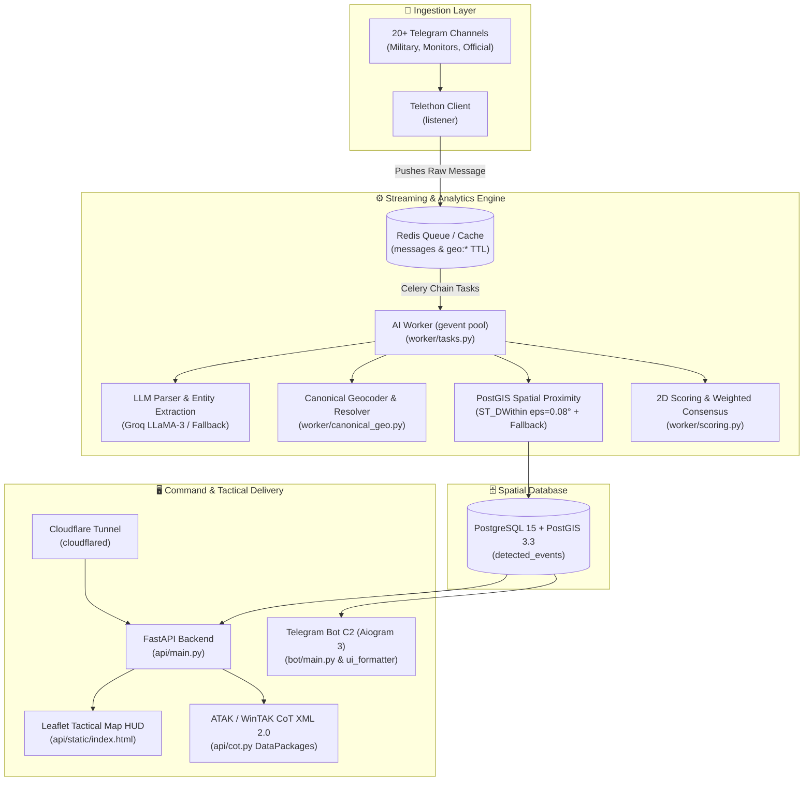

# 🛰️ Lyudyn-Iskun V2: Tactical OSINT Early Warning C2 Platform

[](https://github.com/wakkawarpman-oss/lyudyn-iskun-v2/actions)
[](https://opensource.org/licenses/MIT)
[](https://www.python.org/downloads/release/python-3110/)
[](https://postgis.net/)

**Суверенна тактична OSINT-система ситуаційної обізнаності та раннього оповіщення для Києва та Київської області.**

Платформа забезпечує безперервний збір первинних повідомлень із моніторингових, військових та екстрених каналів у режимі реального часу, структуровану екстракцію сутностей за допомогою LLM-пайплайну, геопросторову кластеризацію через PostGIS, генерацію тактичних CoT (Cursor-on-Target) DataPackages для ATAK/WinTAK, та доставку верифікованих оперативних зведень через Telegram C2 та веб-карту.

---

## 📐 Архітектура системи (Architecture Topology)



---

## 🌟 Ключові функціональні можливості

1. **Kyiv-Exclusive Geofence & Filtering**: Суворе відсікання повідомлень поза межами Київського регіону з канонічним словником топонімів (райони, міста, ОТГ).
2. **PostGIS Spatial Clustering (A.4)**: Геопросторове об'єднання повідомлень однієї хвилі в межах $\varepsilon = 0.08^\circ$ (~8.8 км) у 30-хвилинному вікні з текстовим фоллбеком.
3. **Multi-Source Weighted Consensus (A.5)**: Багаторівнева система довіри до джерел (Офіційні / Моніторингові / Медіа) та розрахунок резонансу.
4. **Time-Window Rate & Spike Detection (A.2)**: Детекція масованих атак за динамікою появи подій у вікнах 5хв / 15хв / 60хв.
5. **Cursor-on-Target (CoT 2.0) & ATAK/WinTAK DataPackages**: Генерація та експорт тактичних пакетів у форматі MIL-STD-2525C (`/api/cot/zip`, `/api/cot`) з повною підтримкою WinTAK/ATAK.
6. **WEZ Air Defense & Radar Envelopes**: Розрахунок зон ураження (WEZ) та радарного покриття для комплексів Тор-М2, Панцир-С1, Бук-М3, С-400 (`/api/v1/threats/wez-envelopes`).
7. **Geodesic LOB Triangulation & CEP**: Геодезична пряма засічка WGS-84, триангуляція азимутів спостереження та розрахунок кругового ймовірного відхилення (CEP) епіцентру цілей (`/api/v1/recon/triangulate-lob`).
8. **CCTV Optical Reconnaissance**: База 315+ вузлів оптичного спостереження ТОТ (Донецьк, Севастополь, Луганськ, Енергодар) та прифронтового сектору Харкова з розрахунком Time-on-Target (`/api/v1/recon/cctv-cameras`).
9. **NOAA Solar Chronolocation**: Астрономічна верифікація часу та напрямку зйомки за кутом сонця та проєкцією векторів тіней.
10. **Bidirectional Bot-Map Synchronization**: Двостороння шина Redis Pub/Sub (`POST /api/v1/sync`, кнопка `🔄 СИНХР` на мапі та `/sync` у боті) для миттєвої актуалізації даних.
11. **Deep-Linking & Tactical HUD**: Прямі посилання на шари карти (`?layer=wez`, `?layer=lob`, `?layer=cctv`, `?layer=ew`), інтерактивний таймлайн (1г – 72г), офлайн MBTiles fallback.

---

## 🛠️ Стек технологій

* **Мова:** Python 3.11
* **Фреймворки:** FastAPI, Celery 5.3, Aiogram 3.4, Telethon 1.33, GeoAlchemy2, SQLAlchemy 2.0
* **База даних:** PostgreSQL 15 + PostGIS 3.3
* **Брокер & Кеш:** Redis 7 Alpine
* **Картографія & CoT:** Leaflet JS (Canvas GPU), XML ElementTree (CoT 2.0)
* **LLM Engine:** Groq API (LLaMA-3) / OpenAI API з правилами захисту від галюцинацій

---

## ⚙️ Змінні середовища (`.env`)

| Змінна | Опис | Обов'язкова |
| :--- | :--- | :---: |
| `DATABASE_URL` | URL підключення до PostgreSQL (`postgresql://iskun:pass@db:5432/iskun`) | **ТАК** |
| `REDIS_URL` | URL підключення до Redis (`redis://redis:6379/0`) | **ТАК** |
| `SECRET_KEY` | Майстер-сіль для Fernet-шифрування ключів | **ТАК** |
| `BOT_TOKEN` | Токен Telegram-бота від BotFather | **ТАК** |
| `ADMIN_ID` | Telegram User ID адміністратора | **ТАК** |
| `API_ID` | Telegram API ID (my.telegram.org) | **ТАК** |
| `API_HASH` | Telegram API Hash (my.telegram.org) | **ТАК** |
| `SESSION_STRING` | Авторизована Telethon String-сесія | **ТАК** |
| `TARGET_CHANNELS` | Список каналів для моніторингу через кому | **ТАК** |
| `GROQ_API_KEY` | API ключ Groq для швидкої обробки | НІ |
| `OPENAI_API_KEY` | API ключ OpenAI (фоллбек) | НІ |
| `TACTICAL_FEED_TOKEN` | Bearer токен для захисту CoT / ATAK фіду | НІ |

---

## 🚀 Розгортання та запуск (Deployment)

### 1. Клонування та налаштування
```bash
git clone https://github.com/wakkawarpman-oss/lyudyn-iskun-v2.git
cd lyudyn-iskun-v2
cp .env.example .env
# Заповніть змінні в .env
```

### 2. Запуск через Docker Compose
```bash
docker compose build
docker compose up -d
```

### 3. Перевірка статусу сервісів
```bash
docker compose ps
curl http://localhost/api/stats
```

### 4. Запуск тестів локально
```bash
SECRET_KEY=test_secret_key pytest tests/ -v
```

---

## 📄 Ліцензія
Розповсюджується під ліцензією MIT. Див. [LICENSE](LICENSE) для деталей.
