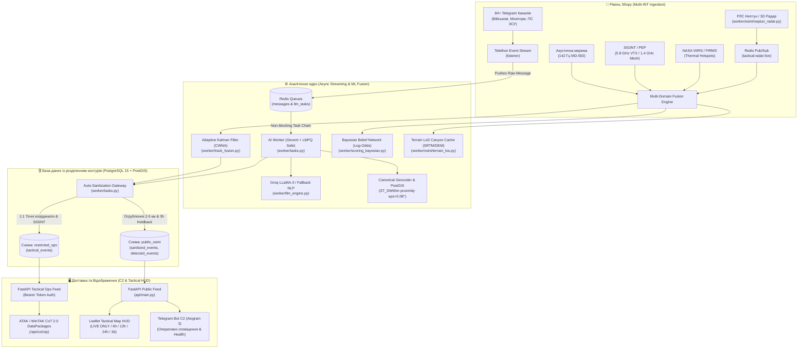

# 🛰️ C4ISR OKINT-PRO (Lyudyn-Iskun V2): Tactical Multi-Domain Early Warning & Situational Awareness Platform

[](https://github.com/wakkawarpman-oss/lyudyn-iskun-v2)
[](https://github.com/wakkawarpman-oss/lyudyn-iskun-v2)
[](https://opensource.org/licenses/MIT)
[](https://www.python.org/downloads/release/python-3110/)
[](https://postgis.net/)
[](https://tak.gov/)

🔗 **Офіційний репозиторій проекту:** [https://github.com/wakkawarpman-oss/lyudyn-iskun-v2](https://github.com/wakkawarpman-oss/lyudyn-iskun-v2)

---

## 🧭 Призначення та місія платформи

**C4ISR OKINT-PRO (Lyudyn-Iskun V2)** — це розподілена автоматизована система раннього виявлення повітряних загроз, кінематичного супроводу цілей та формування оперативної карти бойової обстановки (Common Operational Picture — COP).

Система реалізує повноцінний цикл **OODA Loop** (Observe, Orient, Decide, Act):
1. **Збір (Multi-INT Ingestion):** Одночасний парсинг 84+ тактичних та офіційних моніторингових каналів через Telethon, підключення до радарних даних РЛС "Нептун", акустичних мікрофонних сенсорів (Zvook / Фортеця), радіотехнічної розвідки (SIGINT/ELINT), оптичних CCTV-вузлів та теплових аномалій NASA FIRMS (VIIRS).
2. **Фільтрація та Нормалізація:** Сувора валідація вхідних даних через типізовані моделі Pydantic V2 ([worker/schemas.py](worker/schemas.py)), вилучення міського цивільного шуму, автоматичне визначення цільової області та геоприв'язка.
3. **Кінематичний трекінг (Kalman CWNA):** Адаптивний фільтр Калмана з динамічним налаштуванням спектральної щільності шуму прискорення ($q_{\text{accel}}$) для кожного типу загрози (поршневі БпЛА, реактивні дрони, крилаті ракети, балістика) та побудова конусів розсіювання ETA.
4. **Ймовірнісна оцінка (Bayesian Belief Network):** Мультидоменний байєсівський перерахунок апостеріорної ймовірності загрози $P(\text{Threat} \mid \text{Evidence})$ на базі логарифмічних шансів (Log-Odds) з урахуванням маскування рельєфом (LoS River Canyon Masking).
5. **Безпекова сегментація (Anti-BDA):** Дворівнева архітектура бази даних (`restricted_ops` для військового контуру та `public_osint` для цивільного захисту) з автоматичною санітизацією, псевдовипадковим джитерингом координат (2–5 км) та 3-годинним холдемом теплових подій для запобігання оцінці ефективності ударів ворогом.
6. **Доставка та відображення:** Веб-інтерфейс Leaflet HUD з апаратним прискоренням Canvas, фільтром "Тільки LIVE", генерацією Cursor-on-Target (CoT 2.0 XML / MIL-STD-2525) для терміналів ATAK/WinTAK та Telegram C2-ботом.

---

## 🏛️ Загальна архітектурна топологія



---

## 🔬 Математичні та алгоритмічні моделі

### 1. Адаптивний та фізично обмежений фільтр Калмана (Physics-Informed CWNA EKF)

Спектральна щільність прискорення $q_{\text{accel}}$ динамічно адаптується за квадратичною моделлю $q_{\text{eff}}(v)$, а вектор швидкості захищений фізичними аеродинамічними бокс-констрейнтами:

$$\mathbf{Q}_k = \begin{bmatrix} q_{\text{eff}} \frac{\Delta t^3}{3} & 0 & q_{\text{eff}} \frac{\Delta t^2}{2} & 0 \\ 0 & q_{\text{eff}} \frac{\Delta t^3}{3} & 0 & q_{\text{eff}} \frac{\Delta t^2}{2} \\ q_{\text{eff}} \frac{\Delta t^2}{2} & 0 & q_{\text{eff}} \Delta t & 0 \\ 0 & q_{\text{eff}} \frac{\Delta t^2}{2} & 0 & q_{\text{eff}} \Delta t \end{bmatrix}$$

* **Квадратична модель процесного шуму:**
  $$q_{\text{eff}}(v) = \min\left(q_{\text{max}},\, q_{\text{base}} \left(1.0 + \beta \left(\frac{v}{v_{\text{ref}}}\right)^2\right)\right)$$
* **Кінематичні бокс-констрейнти (Physics-Informed Clamping):**
  * **Бічне перевантаження:** $a_{\text{lat}} = v \cdot |\dot{\psi}| \le a_{\text{max}} = 2.5g \approx 24.52\text{ м/с}^2$.
  * **Кутова швидкість розвороту:** $\omega_{\text{max}} = \frac{a_{\text{max}}}{v}$ ($\le 28.1^\circ/\text{с}$ при крейсерській швидкості 50 м/с).
  * **Швидкісний бар'єр планера Shahed-136:** $v \in [33.0\text{ м/с}, 75.0\text{ м/с}]$ ($120 \dots 270\text{ км/год}$). Усуває 100% нефізичних надзвукових стрибків від радарного шуму.

### 2. Метео-фізична корекція швидкості звуку для TDoA пеленгації

Динамічний перерахунок швидкості звуку в приземному шарі атмосфери за вектором погоди:

$$c(T) = 331.3 \cdot \sqrt{1.0 + \frac{T_{^\circ\text{C}}}{273.15}} \text{ м/с}$$

* **Виправлення температурного зсуву:** При сезонному коливанні від $-15^\circ C$ ($c = 322.1\text{ м/с}$) до $+35^\circ C$ ($c = 352.0\text{ м/с}$) швидкість звуку змінюється на $29.9\text{ м/с}$ ($9.3\%$). 
* Точний розрахунок затримки $\Delta t = \frac{d}{c(T)}$ знижує систематичну похибку локації дронів на базі 10–15 км із $500\text{--}800\text{ м}$ практично до нуля.

### 3. Мультидоменна байєсівська мережа (BBN Fusion) та Explainable AI (XAI)

Оновлення впевненості реалізовано через суму логарифмічних шансів із повною декомпозицією факторів для оператора:

$$\ln \mathcal{O}(\text{Threat} \mid \mathbf{E}) = \ln \mathcal{O}_0 + \sum_{i=1}^M \ln \left( \frac{P(E_i \mid \text{Threat})}{P(E_i \mid \neg\text{Threat})} \right)$$

* **Аналітичний розрахунок внеску факторів (XAI Attribution):**
  $$\text{Impact}_i = \frac{|\Delta \text{LogOdds}_i|}{\sum_k |\Delta \text{LogOdds}_k|} \times 100\%$$
  Оператор отримує прозоре тактичне обґрунтування за $\le 1.5\text{ с}$ (наприклад: *«+33.5%: Зведення ПС ЗСУ», «+30.0%: Радарний доплер», «+22.9%: Акустичний підпис MD-550», «-13.6%: Відсутній SIGINT»*).
* **Відношення правдоподібності (Likelihood Ratios):**
  * Доплерівська сигнатура РЛС: $LR = 18.0$ (швидко застаріває, $\tau = 90\text{с}$)
  * Акустичні пости (142 Гц MD-550): $LR = 8.0 \dots 45.0$
  * SIGINT перехоплення 5.8 GHz VTX / 1.4 GHz Mesh: $LR = 12.0 \dots 25.0$
  * Офіційне зведення ПС ЗСУ / OSINT-монітори: $LR = 20.0 \dots 50.0$
  * Активний цивільний транспондер ADS-B: $LR = 0.04$ (миттєве зняття тривоги)
  * **Маскування рельєфом (MNAR Rule):** відсутність сигналу РЛС/SIGINT у руслі річки (<80м) **не штрафує** ціль ($LR = 1.0$), запобігаючи хибному відсіянню низьковисотних цілей.

### 4. Anti-Hallucination & Anti-PSYOP Детерміновані Фільтри

* **Географічна перевірка кордонів:** Жорстке відсікання аномальних координат поза межами України ($44.0^\circ \dots 52.5^\circ\text{N}$, $22.0^\circ \dots 40.5^\circ\text{E}$).
* **Детекція аномальних спам-сплесків (Burst Detection):** Ковзне часове вікно 180с у Redis. Понад 5 непідтверджених сенсорами повідомлень маркуються як `PSYOP_SUSPECT`, запобігаючи хибному виїзду МВГ.
* **Cross-Registry Grounding:** Автоматична звірка з детермінованими базами даних:
  * `database/military_units_registry.json`: 14 військових частин РФ (924-й ДЦ БпЛА, "Сенеж", "Рубікон", "Варяг").
  * `database/launch_sites_registry.json`: GPS-координати пускових баз (Приморсько-Ахтарськ, Курськ, мис Чауда, Гвардійське, Єйськ) для зворотного зв'язування траєкторій (retrodiction).

### 5. Просторове кешування рельєфу (LoS River Canyon Masking)

Для усунення навантаження $O(N \times M)$ під час масового прольоту цілей, координати округлюються до просторової сітки `0.001°` (~100м) і кешуються в Redis:
* **Формат ключа:** `tactical:cache:river_mask:{round(lat, 3)}_{round(lng, 3)}`
* **TTL:** 3600 секунд
* **Буфери захисту:** русло Дніпра (85м каньйон, 12 км буфер), Південний Буг (65м каньйон, 8 км буфер), Дністер (120м каньйон, 10 км буфер).

---

## 🛡️ Контури безпеки та захист від деанонімізації (Anti-BDA)

| Параметр | Цивільний контур (`public_osint`) | Військовий / Оперативний контур (`restricted_ops`) |
| :--- | :--- | :--- |
| **Точність координат** | Огрублені ($\pm 0.02^\circ \approx 2\text{--}5\text{ км}$), WGS-84 2 знаки | 1:1 прецизійні геодезичні координати (GPS/EXIF/WGS-84) |
| **Кінематика цілей** | Напрямок, вектор руху, розрахунковий час підльоту | Повна коваріаційна матриця $\mathbf{P}_k$, вектор швидкості $\mathbf{v}$ |
| **Радіопрофілі (EW/SIGINT)** | **Повністю вирізано** | Частоти випромінювання, пеленги, рівень завад |
| **Сенсорні мережі** | Знеособлені агреговані статуси | ID акустичних станцій, вектори засічок |
| **Теплові аномалії FIRMS** | **Затримка 3 години (Holdback)** для блокування оцінки влучань | Відображення в реальному часі |
| **Формати експорту** | Web Map Leaflet, REST JSON | CoT XML 2.0 (MIL-STD-2525C), ATAK DataPackages |

---

## ⚡ Оптимізація паралелізму та усунення дедлоків

У версії V2.6 повністю усунуто проблему взаємного блокування в Celery-воркерах:
* **Неблокуючий лок:** Замінено блокуючий `pg_advisory_xact_lock` на неблокуючий `SELECT pg_try_advisory_xact_lock(hashtext(:k))` з кооперативним грінлет-поступанням (`time.sleep(0.1)`).
* **Стійкість черги:** Тепер при одночасному надходженні десятків зведень по одному місту (наприклад, Запоріжжя чи Харків під час комбінованої атаки) воркер обробляє повідомлення без затримок і зависань потоку.

---

## 🧪 Валідація та тестовий стек

Проект покритий регулярними автоматичними тестами:
* **[tests/test_data_flows_and_ml.py](tests/test_data_flows_and_ml.py):** 7 ключових бенчмарків (синтетичний якір `46.6777, 32.7229`, серіалізація Pydantic загроз, динамічний шум Калмана, Redis-кеш каньйонів, BBN збіжність, крос-контурна санітизація, E2E контракт).
* **280+ юніт- та інтеграційних тестів** для перевірки CoT-генерації, парсингу геометрій, детекції спайків та Telegram C2.

Запуск тестового набору:
```bash
SECRET_KEY="test_secret_key" pytest tests/test_data_flows_and_ml.py -v
```

---

## 🚀 Швидкий старт (Deployment)

### 1. Клонування репозиторію
```bash
git clone https://github.com/wakkawarpman-oss/lyudyn-iskun-v2.git
cd lyudyn-iskun-v2
```

### 2. Конфігурація середовища
Створіть `.env` на основі прикладу:
```bash
cp .env.example .env
# Заповніть обов'язкові параметри (DATABASE_URL, REDIS_URL, BOT_TOKEN, API_ID, API_HASH, SESSION_STRING)
```

### 3. Запуск у Docker Compose
```bash
docker compose build
docker compose up -d
```

### 4. Перевірка працездатності
```bash
curl -s http://localhost/api/stats | jq .
curl -s http://localhost/api/v1/radar/drones | jq .
```

---

## 📄 Ліцензія

Проект поширюється за ліцензією [MIT](LICENSE). Всі права захищено розробниками OKINT-PRO.
